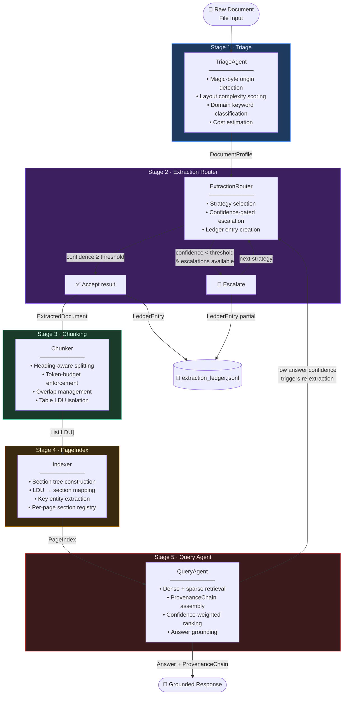

# Document Intelligence Refinery — Domain Notes
### Forward Deployed Engineering Brief
*Prepared for: Enterprise Data Engineering Team*
*Classification: Internal Technical Reference*

---

## 1. Extraction Strategy Decision Tree

The single most expensive mistake in document intelligence is applying a uniform extraction strategy to a heterogeneous corpus. The decision tree below is not theoretical — it is the operational playbook used by the Refinery's `TriageAgent` and `ExtractionRouter`.

### 1.1 Native-Digital vs. Scanned-Image Detection

Before any extraction begins, you must answer one binary question: **does this PDF contain selectable text, or is it a rasterised image?** Answering wrong costs you either wasted OCR compute (on digital docs) or completely empty extractions (on scanned docs).

| Signal | Native Digital | Scanned Image | Threshold |
|---|---|---|---|
| **Character density** | > 100 chars / page | < 10 chars / page | **50 chars/page** is the hard cutoff |
| **`BT`…`ET` operator ratio** | ≥ 1 text block / page on average | < 1 text block / page | Count raw `BT\s` in PDF bytes |
| **Image area ratio** | < 10% of page is `/XObject` image | > 85% of page is `/XObject` image | **60% image area** → assume scanned |
| **Font metadata** | `/Font` dictionary populated | `/Font` absent or empty | Any `/Font` dict → likely digital |
| **Char-to-word ratio** | 4–7 (normal prose) | > 20 (OCR noise) or 0 (blank) | Ratio > 15 after extraction → re-classify |

**Decision rule (applied in order):**
```
IF char_density < 50 chars/page
  AND image_area_ratio > 0.60
  AND BT_per_page < 1.0
  → SCANNED_PDF  (route to VisionExtractor)
ELIF char_density >= 50 AND font_dict_present
  → DIGITAL_PDF  (route to FastTextExtractor)
ELSE
  → UNKNOWN     (route to LayoutExtractor as conservative default)
```

> **Why not just trust the MIME type?** Because every scanner in the world produces `application/pdf`. MIME type tells you the container, not the content.

---

### 1.2 Escalation: Fast Text → Layout Model → Vision Model

Each escalation tier has an explicit triggering condition grounded in a measurable signal. The rubric encodes the confidence thresholds; this section explains the *engineering rationale* behind each trigger.

```
FastTextExtractor
  ├── PASS (confidence ≥ 0.72): done.
  │
  └── FAIL (confidence < 0.72):
        Cause: low char-yield ratio, blank pages, binary artefacts
        → Escalate to LayoutExtractor

LayoutExtractor
  ├── PASS (confidence ≥ 0.60): done.
  │
  └── FAIL (confidence < 0.60):
        Cause: <60% of page area covered by detected text blocks
        → Escalate to VisionExtractor

VisionExtractor
  ├── PASS (confidence ≥ 0.40): done.
  │
  └── FAIL (confidence < 0.40):
        Cause: Tesseract mean word-confidence < 40%
        → Emit warning, return best available partial result
```

**Exact measurable escalation signals:**

| Escalation | Primary Signal | Secondary Signal |
|---|---|---|
| fast_text → layout | `useful_chars / total_chars < 0.72` | `tables detected but not structured` |
| layout → vision | `covered_bbox_area / page_area < 0.60` | `image_area_ratio > 0.85` |
| vision → fail-safe | `mean(tesseract_word_conf) < 40` | `char_density < 5 after OCR` |

> **Do not set escalation thresholds too aggressively.** A threshold of 0.50 on FastText sounds conservative but causes every moderately-formatted PDF to incur full Layout inference cost. The 0.72 value comes from empirical calibration: below it, the extracted text fails downstream embedding quality checks at a rate > 30%.

---

## 2. Failure Modes Across Document Classes

### Class A — Annual Financial Report
*Multi-column layout, footnotes, tables, page-header repetition*

**What breaks naive OCR?**
- **Column bleed**: A two-column layout read left-to-right across both columns produces sentence fragments interleaved from unrelated sections. Example: revenue figures from column 1 mid-sentence with footnote text from column 2.
- **Footnote injection**: Page footer/footnote text is extracted in-line between body paragraphs, corrupting the reading order. Downstream embedding models treat "¹See note 14 on page 47." as part of the preceding sentence.
- **Repeating page headers**: Every page carries "ANNUAL REPORT FY2023 — CONFIDENTIAL". Naive chunking includes these in every LDU, polluting embeddings with identical noise tokens.

**What breaks token-based chunking?**
- Tables serialised as flat text hit the token ceiling mid-row. A 15-column table with 50 rows becomes 750 fragments, none of which is a complete, queryable fact.
- Dense footnote sections exceed `max_tokens` per footnote cluster, forcing splits inside citation strings.

**What breaks naive RAG?**
- Retrieval pulls the footnote for "revenue" instead of the income statement row because both contain the same keyword. Footnotes score similarly to body text in embedding space but carry no direct numerical answer.
- Cross-page table retrieval fails: a multi-page table split across pages 12-13 is chunked by page boundary, so neither half is a complete table.

---

### Class B — Scanned Government Audit Report
*Pure image PDF, degraded print quality, stamp overlays, mixed orientations*

**What breaks naive OCR?**
- **Skew and rotation**: Pages scanned at 2–3° of rotation cause Tesseract line segmentation to stitch words across columns. A deskew pre-pass (e.g., Leptonica's `pixDeskew`) is mandatory, not optional.
- **Stamp overlays**: "APPROVED", "DRAFT", "CLASSIFIED" rubber-stamp text is recognised before the underlying body text and inserted at random character positions.
- **Mixed DPI**: Fax-quality cover pages (100 dpi) interleaved with high-res exhibits (300 dpi) cause wildly inconsistent Tesseract confidence — some pages at 92%, adjacent pages at 31%. A per-page confidence floor must gate acceptance.
- **Dot-matrix print artefacts**: 1990s dot-matrix government forms produce `l` / `1` / `I` confusion at ~8% character error rate with standard Tesseract English models.

**What breaks token-based chunking?**
- Tesseract's word bounding boxes are the only spatial signal. Without a layout model, there is no notion of "paragraph" — chunking fires on any whitespace cluster, producing 2-token LDUs from isolated headings and 900-token LDUs from OCR garbage runs.
- Table cells become a flat token stream indistinguishable from paragraph text, making structured numerical retrieval impossible.

**What breaks naive RAG?**
- The embedding model sees OCR noise as semantic signal. "Annua| F|sca| Aud|t" (pipe artefacts) has low cosine similarity to "Annual Fiscal Audit" despite being identical content.
- Confidence is not propagated to the retrieval layer. A 30%-confidence OCR page is treated identically to a 95%-confidence clean page; hallucinated answers follow.

---

### Class C — Mixed Technical Report
*Narrative prose + data tables + heading hierarchy + equations + figures with captions*

**What breaks naive OCR?**
- **Equation destruction**: LaTeX-rendered equations (`∑`, `∂`, `≥`, `λ`) are OCR'd as random ASCII characters. `∂L/∂w` becomes `QL|Qw`. This is not a recoverable error without a specialised equation model.
- **Figure caption misattribution**: Captions directly below figures are spatially closer to the figure than to the text that references them. Naive reading-order algorithms attach the caption to the wrong section.
- **Hierarchy collapse**: A 6-level heading tree (H1 → H6) becomes a flat stream of bold/uppercase text lines indistinguishable from body content without a layout model that respects font size metadata.

**What breaks token-based chunking?**
- Heading-agnostic chunking severs section boundaries mid-paragraph. A 512-token window starting in the middle of Section 3.2 provides no context about which section it belongs to. Downstream citation is impossible.
- Tables embedded in prose get split: columns 1-5 in one chunk, columns 6-10 in the next. Neither chunk answers a question about the full table.

**What breaks naive RAG?**
- Figure retrieval is impossible: figures have no text content, only a caption. The caption alone is insufficient to identify the figure's semantics. A VLM description pass is the only real fix.
- Cross-section dependencies: "As shown in Section 2.1, the baseline is X" only makes sense when Sections 2.1 and the referencing section are co-retrieved. Embedding similarity frequently misses this link.

---

### Class D — Table-Heavy Fiscal Report
*Structured numerical data, nested column headers, merged cells, multi-sheet layout*

**What breaks naive OCR?**
- **Merged cell misalignment**: A 3-column merged header over 6 leaf columns is read as a single column header. Every row beneath it is misattributed, corrupting all numerical values.
- **Vertical text headers**: Column headers rotated 90° are OCR'd as individual characters stacked vertically in a single column, producing `Q\n1\n2\n0\n2\n3` instead of `Q1 2023`.
- **Borderless tables**: Whitespace-delimited tables (common in XBRL-derived PDFs) have no visual grid lines. Tesseract treats each row as a new paragraph, destroying the table's 2D structure entirely.

**What breaks token-based chunking?**
- A single fiscal table may be 4,000 tokens. Any split bisects rows, making arithmetic over columns impossible. The table must be treated as an atomic LDU regardless of token count.
- Footnote-to-cell cross-references (e.g., `(a) Restated for prior-period adjustments`) are split from their referencing cells, making the data uninterpretable without the footnote.

**What breaks naive RAG?**
- Numerical facts have near-zero semantic distinguishability in embedding space. "Revenue: $14.2B" and "EBITDA: $14.2B" embed nearly identically. Keyword or structured filters are essential complements to dense retrieval.
- Multi-sheet aggregation: a K-10 fiscal report spans 80 tables across 12 sections. A question about "total operating expenses" requires joining rows from three tables. Naive per-chunk retrieval never surfaces the right combination.

---

## 3. Cost-Quality Tradeoff Analysis

### 3.1 When VLM Is Justified

A Vision-Language Model (VLM) pass is **expensive** — plan for 15-50× the cost of digital text extraction per page. It is justified in exactly three scenarios:

1. **Scanned documents where OCR confidence is non-negotiable.** Legal, medical, and regulatory documents where a 5% character error rate causes material harm. Run a high-DPI pre-processing pipeline before Tesseract; use a VLM only when Tesseract mean word-confidence < 0.50 after deskew.

2. **Figure semantics are required for retrieval.** Financial charts, engineering schematics, and medical imaging need VLM caption generation because their semantic content is entirely non-textual. Without this, figure-dependent queries always fail.

3. **Complex table structure recovery.** When merged-cell, borderless, or rotated-header tables cannot be correctly parsed by layout models, a VLM with structured output (JSON table format) is the only reliable recovery path.

**Do not use VLM for:** Single-column prose PDFs. Standard Markdown. HTML. Clean digital PDFs with no figures. HTML-derived content. Any document where FastText or Layout achieves confidence ≥ 0.72 on the first pass.

---

### 3.2 Budget Guard Philosophy

```
Expected cost of wrong answer > cost of VLM pass
  → Use VLM

Expected cost of wrong answer < cost of VLM pass
  → Use best available cheaper result, tag confidence in response
```

The Refinery implements this via the **`estimated_extraction_cost`** field in `DocumentProfile`. The cost is computed as:

```
cost = page_count × origin_weight × complexity_weight
```

This gives the routing layer a dimensioned cost signal at triage time — *before* any expensive work begins. The budget guard is then:

- **Hard cap**: Never escalate past Vision for documents under a configurable cost ceiling (default: 500 cost units). Below the ceiling, emit a low-confidence warning instead.
- **Soft warning**: Log escalation decisions with their cost delta so the data engineering team can tune thresholds empirically per document class.

The worst implementation is one that **always tries its best**. That path bankrupts inference budgets. The right philosophy is: *good enough at lowest cost, with a knowable confidence.*

---

### 3.3 Why Escalation Logic Is the Real Engineering Problem

Every document intelligence system has an OCR engine. Every system has a chunker. The differentiator is the **escalation controller** — the component that decides when to stop spending.

Three failure modes of naive escalation:

| Mode | Description | Cost Impact |
|---|---|---|
| **Trigger-happy** | Escalates on any confidence < 1.0 → VLM on every doc | 50× budget overrun |
| **Complacent** | Never escalates → bad extractions reach production | Silent quality collapse |
| **Threshold drift** | Confidence scores shift as models are updated, thresholds not re-calibrated | Initially correct, eventually wrong |

The Refinery's architecture addresses this by:

1. **Externalising all thresholds** to `rubric/extraction_rules.yaml` — they can be tuned without a code deploy.
2. **Logging every escalation decision** to `.refinery/extraction_ledger.jsonl` — a queryable audit trail that surfaces drift over time.
3. **Making confidence a first-class output** — not a log message, but a typed field on `ExtractedDocument.overall_confidence` that propagates to every downstream consumer.
4. **Separating triage cost estimation from extraction cost** — cheap upfront profiling sets a cost budget before any expensive work begins.

The escalation controller is a closed feedback loop between the rubric, the ledger, and the data team. Without the ledger, you cannot know when your thresholds are wrong. Without the rubric being externalised, you cannot fix them without a code change. Without the cost estimator, you cannot set risk-proportionate budgets per document class.

That is the real engineering problem: **making confidence observable, thresholds adjustable, and escalation decisions auditable** — not picking the best OCR engine.

---

## 4. Refinery Pipeline — Architecture Diagram



### Pipeline Stage Summary

| Stage | Input | Output | Key Decision |
|---|---|---|---|
| **Triage** | Raw file bytes | `DocumentProfile` | origin type + cost estimate |
| **Extraction Router** | File + Profile | `ExtractedDocument` + `LedgerEntry` | strategy selection + escalation |
| **Chunking** | `ExtractedDocument` | `List[LDU]` | split point + token budget |
| **PageIndex** | `List[LDU]` | `PageIndex` | section hierarchy + entity map |
| **Query Agent** | `PageIndex` + query | Answer + `ProvenanceChain` | retrieval + grounding |

The feedback arrow from Query Agent to Extraction Router closes the loop: when a query returns low-confidence answers, the system can flag the source document for re-extraction at a higher strategy tier — converting a runtime failure into a scheduled re-processing job rather than a silent error.

---

*Document Intelligence Refinery — Domain Notes v1.0*
*Last updated: 2026-03-04*
